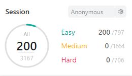

# leet-code

# String
|  |
| ------- |
| [1823-determine-if-string-halves-are-alike](https://github.com/changminkangkk/leet-code/tree/master/1823-determine-if-string-halves-are-alike) |
| [1920-determine-color-of-a-chessboard-square](https://github.com/changminkangkk/leet-code/tree/master/1920-determine-color-of-a-chessboard-square) |
| [1954-replace-all-digits-with-characters](https://github.com/changminkangkk/leet-code/tree/master/1954-replace-all-digits-with-characters) |
| [2292-counting-words-with-a-given-prefix](https://github.com/changminkangkk/leet-code/tree/master/2292-counting-words-with-a-given-prefix) |
| [2847-find-maximum-number-of-string-pairs](https://github.com/changminkangkk/leet-code/tree/master/2847-find-maximum-number-of-string-pairs) |
| [3312-number-of-changing-keys](https://github.com/changminkangkk/leet-code/tree/master/3312-number-of-changing-keys) |
| [3426-minimum-number-of-chairs-in-a-waiting-room](https://github.com/changminkangkk/leet-code/tree/master/3426-minimum-number-of-chairs-in-a-waiting-room) |
# Array
|  |
| ------- |
| [1938-minimum-operations-to-make-the-array-increasing](https://github.com/changminkangkk/leet-code/tree/master/1938-minimum-operations-to-make-the-array-increasing) |
| [2292-counting-words-with-a-given-prefix](https://github.com/changminkangkk/leet-code/tree/master/2292-counting-words-with-a-given-prefix) |
| [2524-largest-positive-integer-that-exists-with-its-negative](https://github.com/changminkangkk/leet-code/tree/master/2524-largest-positive-integer-that-exists-with-its-negative) |
| [2639-separate-the-digits-in-an-array](https://github.com/changminkangkk/leet-code/tree/master/2639-separate-the-digits-in-an-array) |
| [2844-sum-of-squares-of-special-elements](https://github.com/changminkangkk/leet-code/tree/master/2844-sum-of-squares-of-special-elements) |
| [2847-find-maximum-number-of-string-pairs](https://github.com/changminkangkk/leet-code/tree/master/2847-find-maximum-number-of-string-pairs) |
| [3193-maximum-strong-pair-xor-i](https://github.com/changminkangkk/leet-code/tree/master/3193-maximum-strong-pair-xor-i) |
| [3227-find-missing-and-repeated-values](https://github.com/changminkangkk/leet-code/tree/master/3227-find-missing-and-repeated-values) |
# Hash Table
|  |
| ------- |
| [2053-check-if-all-characters-have-equal-number-of-occurrences](https://github.com/changminkangkk/leet-code/tree/master/2053-check-if-all-characters-have-equal-number-of-occurrences) |
| [2524-largest-positive-integer-that-exists-with-its-negative](https://github.com/changminkangkk/leet-code/tree/master/2524-largest-positive-integer-that-exists-with-its-negative) |
| [2847-find-maximum-number-of-string-pairs](https://github.com/changminkangkk/leet-code/tree/master/2847-find-maximum-number-of-string-pairs) |
| [3193-maximum-strong-pair-xor-i](https://github.com/changminkangkk/leet-code/tree/master/3193-maximum-strong-pair-xor-i) |
| [3227-find-missing-and-repeated-values](https://github.com/changminkangkk/leet-code/tree/master/3227-find-missing-and-repeated-values) |
# Simulation
|  |
| ------- |
| [2639-separate-the-digits-in-an-array](https://github.com/changminkangkk/leet-code/tree/master/2639-separate-the-digits-in-an-array) |
| [2847-find-maximum-number-of-string-pairs](https://github.com/changminkangkk/leet-code/tree/master/2847-find-maximum-number-of-string-pairs) |
| [3426-minimum-number-of-chairs-in-a-waiting-room](https://github.com/changminkangkk/leet-code/tree/master/3426-minimum-number-of-chairs-in-a-waiting-room) |
# Enumeration
|  |
| ------- |
| [2844-sum-of-squares-of-special-elements](https://github.com/changminkangkk/leet-code/tree/master/2844-sum-of-squares-of-special-elements) |
# Math
|  |
| ------- |
| [1920-determine-color-of-a-chessboard-square](https://github.com/changminkangkk/leet-code/tree/master/1920-determine-color-of-a-chessboard-square) |
| [2238-a-number-after-a-double-reversal](https://github.com/changminkangkk/leet-code/tree/master/2238-a-number-after-a-double-reversal) |
| [3227-find-missing-and-repeated-values](https://github.com/changminkangkk/leet-code/tree/master/3227-find-missing-and-repeated-values) |
# Greedy
|  |
| ------- |
| [1938-minimum-operations-to-make-the-array-increasing](https://github.com/changminkangkk/leet-code/tree/master/1938-minimum-operations-to-make-the-array-increasing) |
# Counting
|  |
| ------- |
| [1823-determine-if-string-halves-are-alike](https://github.com/changminkangkk/leet-code/tree/master/1823-determine-if-string-halves-are-alike) |
| [2053-check-if-all-characters-have-equal-number-of-occurrences](https://github.com/changminkangkk/leet-code/tree/master/2053-check-if-all-characters-have-equal-number-of-occurrences) |
# Linked List
|  |
| ------- |
| [0908-middle-of-the-linked-list](https://github.com/changminkangkk/leet-code/tree/master/0908-middle-of-the-linked-list) |
# Two Pointers
|  |
| ------- |
| [0908-middle-of-the-linked-list](https://github.com/changminkangkk/leet-code/tree/master/0908-middle-of-the-linked-list) |
| [2524-largest-positive-integer-that-exists-with-its-negative](https://github.com/changminkangkk/leet-code/tree/master/2524-largest-positive-integer-that-exists-with-its-negative) |
# String Matching
|  |
| ------- |
| [2010-check-if-word-equals-summation-of-two-words](https://github.com/changminkangkk/leet-code/tree/master/2010-check-if-word-equals-summation-of-two-words) |
| [2053-check-if-all-characters-have-equal-number-of-occurrences](https://github.com/changminkangkk/leet-code/tree/master/2053-check-if-all-characters-have-equal-number-of-occurrences) |
| [2292-counting-words-with-a-given-prefix](https://github.com/changminkangkk/leet-code/tree/master/2292-counting-words-with-a-given-prefix) |
# Bit Manipulation
|  |
| ------- |
| [0461-hamming-distance](https://github.com/changminkangkk/leet-code/tree/master/0461-hamming-distance) |
| [3193-maximum-strong-pair-xor-i](https://github.com/changminkangkk/leet-code/tree/master/3193-maximum-strong-pair-xor-i) |
# Trie
|  |
| ------- |
| [3193-maximum-strong-pair-xor-i](https://github.com/changminkangkk/leet-code/tree/master/3193-maximum-strong-pair-xor-i) |
# Sliding Window
|  |
| ------- |
| [3193-maximum-strong-pair-xor-i](https://github.com/changminkangkk/leet-code/tree/master/3193-maximum-strong-pair-xor-i) |
# Matrix
|  |
| ------- |
| [3227-find-missing-and-repeated-values](https://github.com/changminkangkk/leet-code/tree/master/3227-find-missing-and-repeated-values) |
# Sorting
|  |
| ------- |
| [2524-largest-positive-integer-that-exists-with-its-negative](https://github.com/changminkangkk/leet-code/tree/master/2524-largest-positive-integer-that-exists-with-its-negative) |